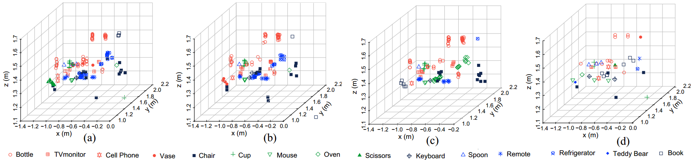
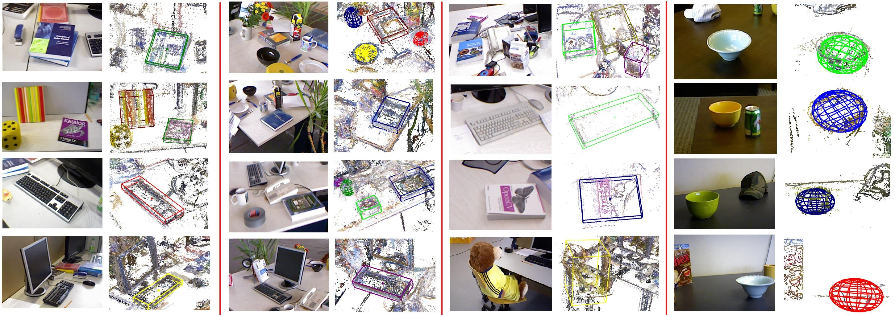
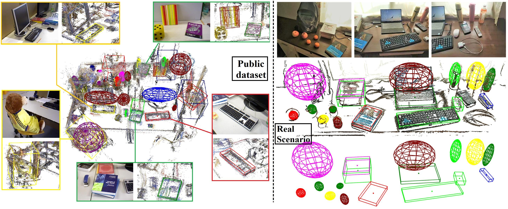

`****` **The code will be available after the paper is accepted.** `****` 

# EAO-SLAM

**Related Paper:**  
+ Wu Y, Zhang Y, Zhu D, et al. **EAO-SLAM: Monocular Semi-Dense Object SLAM Based on Ensemble Data Association**[J]. arXiv preprint arXiv:2004.12730, 2020. [[**PDF**](https://arxiv.org/abs/2004.12730)] [[**YouTube**](https://youtu.be/pvwdQoV1KBI)] [[**bilibili**](https://www.bilibili.com/video/av94805216)]  [[**Project page**](https://yanmin-wu.github.io/project/eaoslam/)]. [Submited to IROS 2020 in March 1, 2020]

## Problems We Targeted
+ **1. Data Association**(Major contribution): Object-level data association is extremely important in semantic SLAM, but there is no good-quality solution at present, especially in multi-object, multi-category and irregular environment. We solved it by **ensemble data association**, which is integrate the parametric and nonparametric statistic tests.
+ **2. Object Modeling**: Perceiving the position, size and orientation of objects is of great help to understanding the environment, but using monocular cameras and geometric methods presents great challenges. We use **iForest-based and line scoring** to solve this problem.
+ **3. Object-oriented map**: Unlike sparse map that can only meet basic positioning needs, object-oriented map can guide robots to more advanced requirements such as grabbing, interaction, and navigation. We used **quadrics and cubes** to create lightweight object-oriented maps and semi-dense object-level semantic maps.

## Experimental Results

More experimental results can be found on our [project page](https://yanmin-wu.github.io/project/eaoslam/).   
Video: [**YouTube**](https://youtu.be/pvwdQoV1KBI) | [**bilibili**](https://www.bilibili.com/video/av94805216)

<figure>

  

</figure>

Fig 1: Data Association

<figure>

  

</figure>

Fig 2: Object Modeling

<figure>

  

</figure>

Fig 3: Object-oriented map

## Note

If the paper is accepted we plan to publish the key code.

## Contact

+ [Yanmin Wu](https://github.com/yanmin-wu), Email: wuyanminmax@gmail.com
+ Corresponding author: [Yunzhou Zhang*](http://faculty.neu.edu.cn/ise/zhangyunzhou), Email: zhangyunzhou@mail.neu.edu.cn
