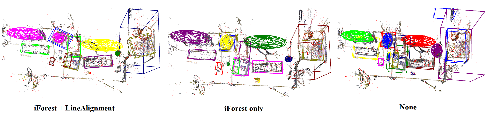
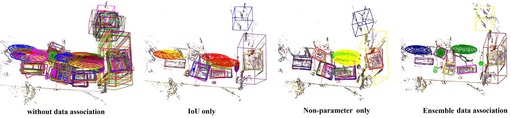

# EAO-SLAM

**Related Paper:**  

+ Wu Y, Zhang Y, Zhu D, et al. **EAO-SLAM: Monocular Semi-Dense Object SLAM Based on Ensemble Data Association**[C]//2020 IEEE/RSJ International Conference on Intelligent Robots and Systems (IROS). IEEE, 2020: 4966-4973. [[**PDF**](https://arxiv.org/abs/2004.12730)] [[**YouTube**](https://youtu.be/pvwdQoV1KBI)] [[**bilibili**](https://www.bilibili.com/video/av94805216)]  [[**Project page**](https://yanmin-wu.github.io/project/eaoslam/)].
+ Extended Work
    + Wu Y, Zhang Y, Zhu D, et al. **Object-Driven Active Mapping for More Accurate Object Pose Estimation and Robotic Grasping**[J]. arXiv preprint arXiv:2012.01788, 2020. [[**PDF**](https://arxiv.org/abs/2012.01788)] [[**Project page**](https://yanmin-wu.github.io/project/active-mapping/)].
    + Robotic Grasping demo: [YouTube](https://youtu.be/cNtvqiArVfI) | [bilibili](https://www.bilibili.com/video/BV1ZA411p7KK)
    + Augmented Reality demo: [YouTube](https://youtu.be/E8jfkO_Q7Iw) | [bilibili](https://www.bilibili.com/video/BV1V5411p7gA)
+ If you use the code in your academic work, please cite the above paper. 

## 1. Prerequisites

+ Prerequisites are the same as [**semidense-lines**](https://github.com/shidahe/semidense-lines#1-prerequisites). If compiling problems met, please refer to semidense-lines and ORB_SLAM2.
+ The code is tested in Ubuntu 16.04, opencv 3.2.0/3.3.1, Eigen 3.2.1.

## 2. Building

```
chmod +x build.sh       
./build.sh
```

## 3. Examples

+ 0. We provide a demo that uses the **`TUM rgbd_dataset_freiburg3_long_office_household`** sequence;  please download the dataset beforehand. The offline object bounding boxes are in `data/yolo_txts` folder.
+ 1. **Object size and orientation estimation**.
    + use **iForest and line alignment**:
        ```
        ./Examples/Monocular/mono_tum LineAndiForest [path of tum fr3_long_office]
        ```
    + only use **iForest**:
        ```
        ./Examples/Monocular/mono_tum iForest [path of tum fr3_long_office]
        ```
    + **without** iForest and line alignment:
        ```
        ./Examples/Monocular/mono_tum None [path of tum fr3_long_office]
        ```
    <figure>
    <p align="center" >
    
    </p>
    </figure>

+ 2. **Data association**
    + **without** data association:
        ```
        ./Examples/Monocular/mono_tum NA [path of tum fr3_long_office]
        ```
    + data association by **IoU** only:
        ```
        ./Examples/Monocular/mono_tum IoU [path of tum fr3_long_office]
        ```
    + data association by **Non-Parametric-test** only:
        ```
        ./Examples/Monocular/mono_tum NP [path of tum fr3_long_office]
        ```
    + data association by our **ensemble method**:
        ```
        ./Examples/Monocular/mono_tum EAO [path of tum fr3_long_office]
        ```
    <figure>
    <p align="center" >
    
    </p>
    </figure>

+ 3. **The full demo on TUM fr3_long_office sequence:**
    ```
    ./Examples/Monocular/mono_tum Full [path of tum fr3_long_office]
    ```
    + If you want to see the semi-dense map, you may have to wait a while after the sequence ends.
    + Since YOLO (which was not trained in this scenario) made a lot of false detections at the start of the sequence, so we adopted a stricter elimination mechanism, which resulted in the deletion of many objects at the start.

## 4. Videos

+ More experimental results can be found on our [project page](https://yanmin-wu.github.io/project/eaoslam/).   
    + Video: [**YouTube**](https://youtu.be/pvwdQoV1KBI) | [**bilibili**](https://www.bilibili.com/video/av94805216)
+ Extended work: [project page](https://yanmin-wu.github.io/project/active-mapping/)
    + Robotic Grasping demo: [YouTube](https://youtu.be/cNtvqiArVfI) | [bilibili](https://www.bilibili.com/video/BV1ZA411p7KK)
    + Augmented Reality demo: [YouTube](https://youtu.be/E8jfkO_Q7Iw) | [bilibili](https://www.bilibili.com/video/BV1V5411p7gA)

## 5. Note

+ This is an incomplete version of our paper. If you want to use it in your work or with other datasets, you should prepare the offline semantic detection/segmentation results or switch to online mode. Besides, you may need to adjust the data association strategy and abnormal object elimination mechanism (We found the misdetection from YOLO has a great impact on the results).

## 6. Acknowledgement

Thanks for the great work: [**ORB-SLAM2**](https://github.com/raulmur/ORB_SLAM2), [**Cube SLAM**](https://github.com/shichaoy/cube_slam), and [**Semidense-Lines**](https://github.com/shidahe/semidense-lines).
+ Mur-Artal R, Tardós J D. **Orb-slam2: An open-source slam system for monocular, stereo, and rgb-d cameras**[J]. IEEE Transactions on Robotics, 2017, 33(5): 1255-1262. [PDF](https://arxiv.org/abs/1610.06475), [Code](https://github.com/raulmur/ORB_SLAM2)
+ Yang S, Scherer S. **Cubeslam: Monocular 3-d object slam**[J]. IEEE Transactions on Robotics, 2019, 35(4): 925-938. [PDF](https://arxiv.org/abs/1806.00557), [Code](https://github.com/shichaoy/cube_slam)
+ He S, Qin X, Zhang Z, et al. **Incremental 3d line segment extraction from semi-dense slam**[C]//2018 24th International Conference on Pattern Recognition (ICPR). IEEE, 2018: 1658-1663. [PDF](https://arxiv.org/abs/1708.03275), [Code](https://github.com/shidahe/semidense-lines)

## 7. Contact

+ [Yanmin Wu](https://yanmin-wu.github.io/), Email: wuyanminmax@gmail.com
+ Corresponding author: [Yunzhou Zhang *](http://faculty.neu.edu.cn/ise/zhangyunzhou), Email: zhangyunzhou@mail.neu.edu.cn